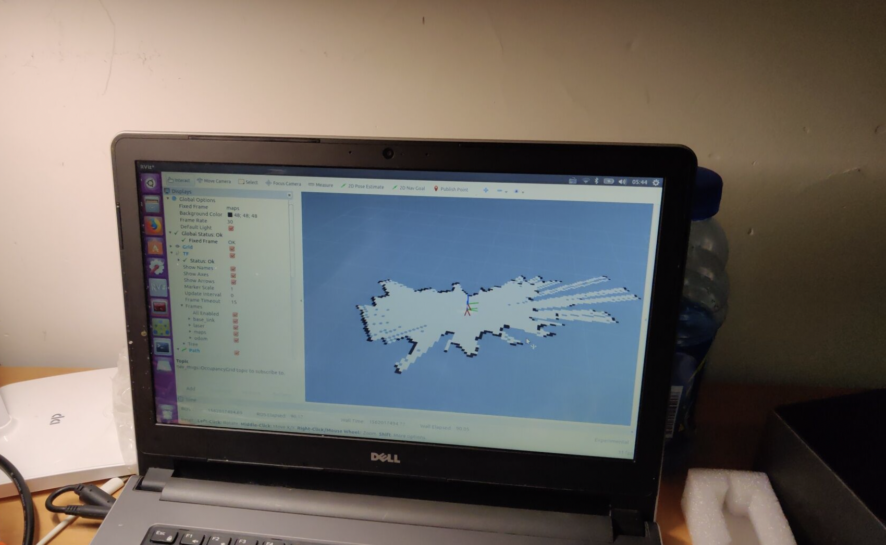

# Self Introduction

 

---

**I am from Huazhong University of Science and Technology. I am studying at School of Electronic Information and Communications Elite Engineer Class.**

---

# My projects
## Rubik’s Cube Robot
https://youtu.be/lwa5qByJMJc

Rubik’s Cube Robot is a project that I worked on in Sophomore year. It is capable of solving any rubix cube in 3 seconds.
A FPGA board serves as the Lower machine, which controls rotors by generating PWM waves.
A cellphone serves as the Upper machine. It calculates the formula and control the FPGA board via Bluetooth.
I led a 3-men team to finish this project.

## ROS+LiDAR Robot
https://github.com/Dedsec-Xu/LiDAR_ros_Robot

The robot is based on STM32 MCU and raspberry pie.
It can navigate to IoT devices and charge them wirelessly. The charge strategy is based on WIFI information exchange and Greedy Algorithm.
I led a 5-men team to finish this project in 2 weeks.
This project won third place in the TI cup competition.

LiDAR mapping and navigation.

## ICDAR-2015 Dataset Label
https://github.com/Dedsec-Xu/DatasetImgLabel-ICDAR2015

# Usage
## macOS
There are two ways of using this program: editing single file and editing multiple files

open file

* Press open file button and select a image.(ctrl + o)

open multiple files

* Press open file dir button and select a path, then double click a file name in the right side. (ctrl + d)

load existing labels from txt

* Press open txt button and selsect a txt, the program will load the rect boxes and show it.
* In multiple files, select the path where txt is saved. And clicking it again will load the txt.

modify labels

* Use left button to drag edge or corner. Use right click to delete. Use right button to drag the box as a whole.

auto label

* Click auto label(this may take a while)

Status bar will always show what you are doing and give instructions to assist you.

You can also click help button for more(I'll translate it later).

Annotations are saved as txt files in ICDAR2015 format. You can also load ICDAR2013 format with openTxt.

## Windows 10
Usage is the same with macOs version except for auto label, which is not yet implemented. But it still works well as a functioning labeler.

# Test on ICDAR2015
The reported results on ICDAR2015  are:

|Model|Recall|Precision|H-mean|
|---|---|---|---|
|PixelLink|81.5|85.4|83.2|

This is lower than F-mean 83.7 from [ZJULearning/pixel_link](https://github.com/ZJULearning/pixel_link), but is enough in this scenario.

# Screen shots

button icons are changed in my final version because I think these may be subject to copyright.

# Acknowlegement
1.https://tensorflow.google.cn/ 

2.https://www.python.org/ 

3.https://www.scipy.org/docs.html 

4.https://www.qt.io/ 

5.https://pytorch.org/ 

6.Ren S, He K, Girshick R, et al. Faster R-CNN: towards real-time object detection with region proposal networks[C]// International Conference on Neural Information Processing Systems. 2015.

7.Redmon J , Divvala S , Girshick R , et al. You Only Look Once: Unified, Real-Time Object Detection[C]// 2016 IEEE Conference on Computer Vision and Pattern Recognition (CVPR). IEEE Computer Society, 2016.

8.Deng D, Liu H, Li X, et al. PixelLink: Detecting Scene Text via Instance Segmentation[J]. arXiv preprint arXiv:1801.01315, 2018. https://github.com/ZJULearning/pixel_link